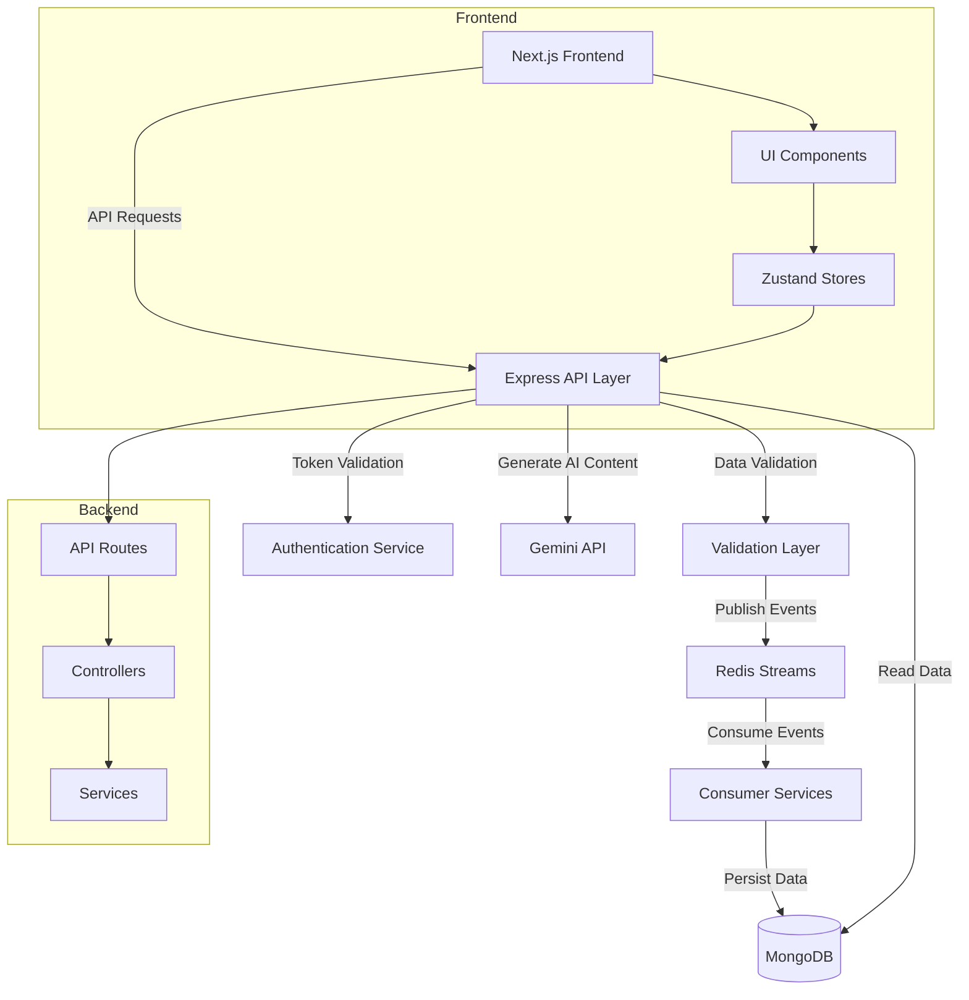

# Mini CRM Platform


A modern customer relationship management platform that enables customer segmentation, personalized campaign delivery, and intelligent insights using AI-powered features.

## ✨ Features

- **Dynamic Audience Segmentation** - Create complex segments with drag-and-drop rule builder
- **Campaign Management** - Create, track, and analyze marketing campaigns
- **Customer & Order Management** - Comprehensive data management and visualization
- **Personalized Messaging** - Send targeted communications to specific audience segments
- **Real-time Analytics** - Track delivery statistics and performance metrics
- **Google OAuth Authentication** - Secure authentication and authorization
- **Asynchronous Data Processing** - Scalable architecture with Redis Streams

### 🧠 AI-Powered Features

- **Natural Language to Segment Rules** - Convert plain English to complex segmentation logic
- **AI-Driven Message Templates** - Generate personalized messaging based on campaign objectives
- **Campaign Performance Insights** - AI-generated summaries and recommendations
- **Smart Scheduling** - Intelligent send time recommendations based on audience behavior
- **Lookalike Audience Generator** - Create similar audiences from successful segments
- **Auto-tagging** - Automatically categorize campaigns based on content and audience
- **Image Concept Suggestions** - Get visual concepts that complement your campaign messaging

## 🚀 Tech Stack

### Frontend
- **Next.js** (v14+) with App Router
- **Shadcn UI** - Component library built on Radix UI and Tailwind CSS
- **Zustand** - Lightweight state management
- **React DnD** - Drag-and-drop functionality
- **Recharts** - Interactive charts and data visualization
- **Axios** - API client

### Backend
- **Node.js** with Express
- **MongoDB** - Document database with native driver
- **Redis Streams** - Pub/sub architecture for async data processing
- **JWT** - Authentication tokens
- **Swagger/OpenAPI** - API documentation

### AI Integration
- **Google's Gemini API** - Generative AI capabilities
- **OpenAI API** (Alternative) - Natural language processing

## 🏗️ Architecture



## 🔧 Installation & Setup

### Prerequisites
- Node.js (v18+)
- MongoDB
- Redis
- Google Cloud account (for OAuth and Gemini API)

### Backend Setup

1. Clone the repository:
```bash
git clone https://github.com/yourusername/mini-crm.git
cd mini-crm/backend
```

2. Install dependencies:
```bash
npm install
```

3. Create a `.env` file based on `.env.example`:
```
# Server configuration
PORT=8080
NODE_ENV=development

# MongoDB connection
MONGODB_URI=mongodb://localhost:27017/miniCrm
DB_NAME=miniCrm

# Redis connection
REDIS_URL=redis://localhost:6379

# JWT configuration
JWT_SECRET=your-secret-key-here

# Google authentication
GOOGLE_CLIENT_ID=your-google-client-id
GOOGLE_CLIENT_SECRET=your-google-client-secret

# Gemini API
GEMINI_API_KEY=your-gemini-api-key
```

4. Start the backend:
```bash
# Development mode
npm run dev

# Production mode
npm start
```

### Frontend Setup

1. Navigate to the frontend directory:
```bash
cd ../frontend
```

2. Install dependencies:
```bash
npm install
```

3. Create a `.env.local` file:
```
NEXT_PUBLIC_API_URL=http://localhost:8080
NEXT_PUBLIC_GOOGLE_CLIENT_ID=your-google-client-id
```

4. Start the frontend:
```bash
# Development mode
npm run dev

# Build for production
npm run build
npm start
```

## 📚 API Documentation

Once the backend is running, you can access the Swagger UI at:
```
http://localhost:8080/api-docs
```

### Key API Endpoints

#### Authentication
- `POST /api/auth/google` - Authenticate with Google
- `POST /api/auth/verify` - Verify authentication token

#### Customers
- `GET /api/customers` - List customers
- `POST /api/customers` - Create customer
- `GET /api/customers/:id` - Get customer details

#### Orders
- `GET /api/orders` - List orders
- `POST /api/orders` - Create order
- `GET /api/orders/:id` - Get order details

#### Campaigns
- `GET /api/campaigns` - List campaigns
- `POST /api/campaigns` - Create campaign
- `GET /api/campaigns/:id` - Get campaign details
- `POST /api/campaigns/preview-audience` - Preview audience size

#### AI Features
- `POST /api/ai/segment-rules` - Generate segment rules from natural language
- `POST /api/ai/message-suggestions` - Generate message templates
- `POST /api/ai/campaign-insights` - Generate campaign performance insights
- `GET /api/ai/scheduling-suggestions` - Get optimal send time recommendations
- `POST /api/ai/lookalike-audience` - Generate lookalike audience
- `POST /api/ai/auto-tag` - Generate campaign tags
- `POST /api/ai/image-suggestions` - Get image concept recommendations

## 💡 AI Features Explained

### Natural Language to Segment Rules
This feature uses Gemini API to parse natural language descriptions and convert them into structured segmentation rules. For example, a user can type "customers who spent over ₹5000 in the last 6 months and haven't shopped recently" and the system will generate the corresponding rule logic.

### AI-Driven Message Suggestions
Based on the campaign objective (e.g., "bring back inactive users"), the system generates personalized message templates that are likely to resonate with the target audience.

### Campaign Performance Insights
Instead of just showing raw stats, this feature provides human-readable insights about campaign performance, including success rates, patterns, and recommendations for improvement.

### Smart Scheduling
Analyzes general email engagement patterns and user behavior to recommend optimal days and times to send campaigns, tailored to different audience segments.

### Lookalike Audience Generator
Creates expanded audience segments based on characteristics of an existing segment, helping marketers reach similar customers who might respond well to the same campaign.

### Auto-tagging
Automatically generates relevant tags for campaigns based on the audience definition, message content, and campaign objective, making organization and reporting easier.

### Image Concept Suggestions
Recommends visual concepts for campaign images based on the message content and tone, including description, color schemes, and rationale for why they would work well.

## 🚢 Deployment

### Backend Deployment (Railway)
1. Create a new project on Railway
2. Connect your GitHub repository
3. Add environment variables
4. Deploy the application

### Frontend Deployment (Vercel)
1. Create a new project on Vercel
2. Connect your GitHub repository
3. Configure environment variables
4. Deploy the application

## ⚠️ Known Limitations

- The AI features require API keys with appropriate rate limits
- The mock vendor API simulates message delivery but doesn't actually send messages
- The batch processing in Redis consumers is simplified for demonstration purposes
- Local development requires running both MongoDB and Redis

## 🔮 Future Improvements

- Add unit and integration tests
- Implement Redis caching for frequently accessed data
- Add export functionality for campaign results
- Enhance analytics with more detailed visualizations
- Add multi-channel campaign support (email, SMS, push notifications)
- Implement A/B testing framework
- Add user roles and permissions

## 📜 License

This project is licensed under the MIT License - see the LICENSE file for details.

---

## 🙏 Acknowledgements

- [Shadcn UI](https://ui.shadcn.com/) for the component library
- [Next.js](https://nextjs.org/) for the React framework
- [MongoDB](https://www.mongodb.com/) for the database
- [Redis](https://redis.io/) for the message broker
- [Google Gemini API](https://ai.google.dev/gemini-api) for AI capabilities

---

Created with ❤️ as a demonstration project for Xeno SDE Internship Position - 2025
