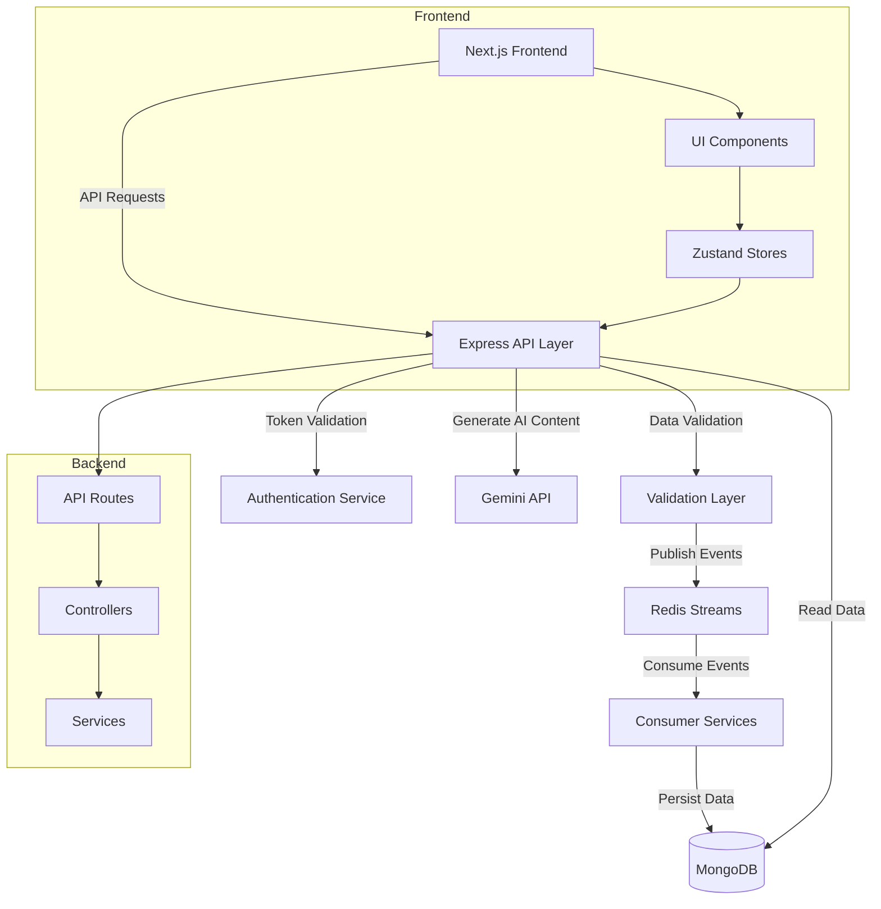

# Mini CRM Platform


A modern customer relationship management platform that enables customer segmentation, personalized campaign delivery, and intelligent insights using AI-powered features.

## ✨ Features

- **Dynamic Audience Segmentation** - Create complex segments with drag-and-drop rule builder
- **Campaign Management** - Create, track, and analyze marketing campaigns
- **Customer & Order Management** - Comprehensive data management and visualization
- **Personalized Messaging** - Send targeted communications to specific audience segments
- **Real-time Analytics** - Track delivery statistics and performance metrics
- **Google OAuth Authentication** - Secure authentication and authorization
- **Asynchronous Data Processing** - Scalable architecture with Redis Streams

### 🧠 AI-Powered Features

- **Natural Language to Segment Rules** - Convert plain English to complex segmentation logic
- **AI-Driven Message Templates** - Generate personalized messaging based on campaign objectives
- **Campaign Performance Insights** - AI-generated summaries and recommendations
- **Smart Scheduling** - Intelligent send time recommendations based on audience behavior
- **Lookalike Audience Generator** - Create similar audiences from successful segments
- **Auto-tagging** - Automatically categorize campaigns based on content and audience
- **Image Concept Suggestions** - Get visual concepts that complement your campaign messaging

### 🚀 Demo Data Generation

- **One-Click Setup** - Populate your CRM with realistic data in minutes
- **AI-Generated Profiles** - Create diverse customer profiles with realistic attributes
- **Simulated Orders** - Generate varied purchasing patterns and product combinations
- **Realistic Campaign Performance** - Simulate real-world campaign delivery and engagement
- **Detailed Metrics** - Analyze comprehensive results across different segments

## 🚀 Tech Stack

### Frontend
- **Next.js** (v14+) with App Router
- **Shadcn UI** - Component library built on Radix UI and Tailwind CSS
- **Zustand** - Lightweight state management
- **React DnD** - Drag-and-drop functionality
- **Recharts** - Interactive charts and data visualization
- **Axios** - API client

### Backend
- **Node.js** with Express
- **MongoDB** - Document database with native driver
- **Redis Streams** - Pub/sub architecture for async data processing
- **JWT** - Authentication tokens
- **Swagger/OpenAPI** - API documentation

### AI Integration
- **Google's Gemini API** - Generative AI capabilities

## 🏗️ Architecture



## 🔧 Installation & Setup

### Prerequisites
- Node.js (v18+)
- MongoDB
- Redis
- Google Cloud account (for OAuth and Gemini API)

### Backend Setup

1. Clone the repository:
```bash
git clone https://github.com/yourusername/mini-crm.git
cd mini-crm/backend
```

2. Install dependencies:
```bash
npm install
```

3. Create a `.env` file based on `.env.example`:
```
# Server configuration
PORT=8080
NODE_ENV=development

# MongoDB connection
MONGODB_URI=mongodb://localhost:27017/miniCrm
DB_NAME=miniCrm

# Redis connection
REDIS_URL=redis://localhost:6379

# JWT configuration
JWT_SECRET=your-secret-key-here

# Google authentication
GOOGLE_CLIENT_ID=your-google-client-id
GOOGLE_CLIENT_SECRET=your-google-client-secret

# Gemini API
GEMINI_API_KEY=your-gemini-api-key
```

4. Start the backend:
```bash
# Development mode
npm run dev

# Production mode
npm start
```

### Frontend Setup

1. Navigate to the frontend directory:
```bash
cd ../frontend
```

2. Install dependencies:
```bash
npm install
```

3. Create a `.env.local` file:
```
NEXT_PUBLIC_API_URL=http://localhost:8080
NEXT_PUBLIC_GOOGLE_CLIENT_ID=your-google-client-id
```

4. Start the frontend:
```bash
# Development mode
npm run dev

# Build for production
npm run build
npm start
```

## 📚 API Documentation

Once the backend is running, you can access the Swagger UI at:
```
http://localhost:8080/api-docs
```

## 🚢 Deployment

The application is deployed using:
- **Backend**: Railway
- **Frontend**: Vercel
- **Database**: MongoDB Atlas
- **Redis**: Redis Cloud

## 💡 AI Features Explained

### Natural Language to Segment Rules
This feature uses Gemini API to parse natural language descriptions and convert them into structured segmentation rules. For example, a user can type "customers who spent over ₹5000 in the last 6 months and haven't shopped recently" and the system will generate the corresponding rule logic.

### AI-Driven Message Suggestions
Based on the campaign objective (e.g., "bring back inactive users"), the system generates personalized message templates that are likely to resonate with the target audience.

### Campaign Performance Insights
Instead of just showing raw stats, this feature provides human-readable insights about campaign performance, including success rates, patterns, and recommendations for improvement.

### Smart Scheduling
Analyzes general email engagement patterns and user behavior to recommend optimal days and times to send campaigns, tailored to different audience segments.

### Lookalike Audience Generator
Creates expanded audience segments based on characteristics of an existing segment, helping marketers reach similar customers who might respond well to the same campaign.

### Campaign Simulation
Allows users to simulate real-world campaign performance with realistic delivery rates and customer responses, providing valuable insights for campaign planning and optimization.

### Demo Data Generator
Quickly populates the CRM with AI-generated customer profiles, orders, and campaign data to demonstrate the platform's capabilities and provide a realistic testing environment.

## 🧪 Testing & Quality Assurance

- **Comprehensive Error Handling** - Graceful handling of failures in both frontend and backend
- **Optimistic Updates** - Immediate UI feedback with background synchronization
- **Responsive Design** - Works seamlessly on mobile, tablet, and desktop devices
- **Accessibility** - Built with a11y best practices using Shadcn UI components
- **Performance Optimization** - Efficient data loading and state management

## 🚀 Extensions and Future Enhancements

Some potential future enhancements for the Mini CRM platform:

- **Multi-channel Campaigns** - Extend beyond message campaigns to email, push notifications, etc.
- **A/B Testing Framework** - Test multiple message variants and analyze results
- **Advanced Analytics Dashboard** - More detailed insights and visualizations
- **Integration with External Services** - Connect with popular marketing tools and services
- **Enhanced AI Capabilities** - More sophisticated audience targeting and personalization
- **Workflow Automation** - Create complex marketing workflows and journeys

## 📜 License

This project is licensed under the MIT License - see the LICENSE file for details.

---

Created with ❤️ for Xeno SDE Internship Position - 2025
